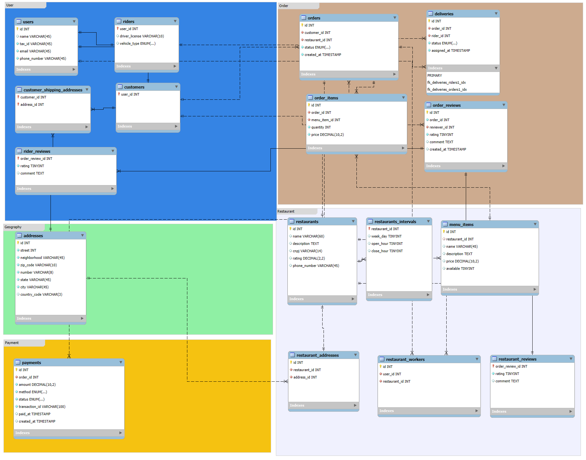

# Banco de dados de um marketplace

## 1. Introdução

O banco de dados do sistema XFood foi desenvolvido para suportar uma **plataforma de entrega de alimentos**, gerenciando informações de estabelecimentos comerciais, usuários do sistema, solicitações de compra, logística de entrega, processamento financeiro e sistema de feedback. A arquitetura segue padrões de **normalização de dados** e **consistência relacional**, criando um ecossistema completo para marketplace gastronômico.

O desenvolvimento utilizou **MySQL** como SGBD, aplicando comandos **DDL (Data Definition Language)** para estruturação das tabelas e **DML (Data Manipulation Language)** para inserção e manipulação de dados de teste.

---

## 2. Arquitetura Conceitual – Visão Sistêmica

### 2.1 Entidades Centrais

O sistema XFood estrutura-se em torno destas entidades fundamentais:

- **Users** → Base de usuários (compradores, motociclistas, colaboradores)
- **Restaurants** → Parceiros comerciais da plataforma
- **Menu Items** → Catálogo de produtos alimentícios
- **Orders** → Solicitações de compra dos consumidores
- **Deliveries** → Gestão logística das entregas
- **Payments** → Processamento de transações financeiras
- **Reviews** → Sistema de avaliação e feedback

### 2.2 Interconexões Principais

- Um **usuário** pode assumir papéis de **consumidor**, **entregador** ou **colaborador** de estabelecimento
- Um **estabelecimento** gerencia diversos **produtos alimentícios** e **localizações**
- Uma **solicitação** agrupa múltiplos **produtos** e gera uma **transação** e **entrega**
- **Consumidores** e **endereços** mantêm relacionamento N:N (múltiplas opções de entrega)

### 2.3. Diagrama Entidade-Relacionamento



---

## 3. Desenvolvimento – DDL (Estruturação)

### 3.1 Criação do Esquema Base

```sql
CREATE SCHEMA IF NOT EXISTS xfood 
  DEFAULT CHARACTER SET utf8
  COLLATE utf8_general_ci;
  
USE xfood;
```

---

### 3.2 Estruturação das Tabelas

#### Tabela `restaurants` (Estabelecimentos)

```sql
CREATE TABLE restaurants (
  id INT NOT NULL PRIMARY KEY,
  name VARCHAR(60) NULL,
  description TEXT NULL,
  cnpj VARCHAR(14) NULL,
  rating DECIMAL(2,2) NULL,                    -- Classificação de 0.00 a 9.99
  phone_number VARCHAR(45) NULL
) ENGINE = InnoDB;
```

* `DECIMAL(2,2)` → classificação precisa com dupla precisão decimal
* `TEXT` → descrições extensas sem restrição de caracteres
* `ENGINE=InnoDB` → compatibilidade com transações e chaves estrangeiras

---

#### Tabela `users` (Base de Usuários)

```sql
CREATE TABLE users (
  id INT NOT NULL PRIMARY KEY,
  name VARCHAR(45) NULL,
  tax_id VARCHAR(45) NOT NULL,                 -- Documento fiscal (CPF/CNPJ)
  email VARCHAR(45) NOT NULL,
  phone_number VARCHAR(45) NOT NULL
) ENGINE = InnoDB;
```

---

#### Tabelas de Especialização por Perfil

```sql
-- Consumidores
CREATE TABLE customers (
  user_id INT NOT NULL PRIMARY KEY,
  CONSTRAINT fk_customers_users
    FOREIGN KEY (user_id) REFERENCES users (id)
) ENGINE = InnoDB;

-- Motociclistas/Entregadores
CREATE TABLE riders (
  user_id INT NOT NULL PRIMARY KEY,
  driver_license VARCHAR(10) NULL,             -- Carteira de habilitação
  vehicle_type ENUM('CAR', 'BIKE', 'MOTORCYCLE') NULL,
  CONSTRAINT fk_riders_users
    FOREIGN KEY (user_id) REFERENCES users (id)
) ENGINE = InnoDB;

-- Colaboradores dos Estabelecimentos
CREATE TABLE restaurant_workers (
  id INT NOT NULL PRIMARY KEY,
  user_id INT NOT NULL,
  restaurant_id INT NOT NULL,
  CONSTRAINT fk_restaurant_workers_users
    FOREIGN KEY (user_id) REFERENCES users (id),
  CONSTRAINT fk_restaurant_workers_restaurants
    FOREIGN KEY (restaurant_id) REFERENCES restaurants (id)
) ENGINE = InnoDB;
```

* **Estratégia de Herança** → users como entidade mãe, especializações como derivadas
* `ENUM` → controle restrito de valores para modalidades de transporte

---

#### Sistema de Localização

```sql
CREATE TABLE addresses (
  id INT NOT NULL PRIMARY KEY,
  street INT NOT NULL,                         -- Identificador da via
  neighborhood VARCHAR(45) NOT NULL,
  zip_code VARCHAR(10) NOT NULL,
  number VARCHAR(8) NOT NULL,
  state VARCHAR(45) NOT NULL,
  city VARCHAR(45) NOT NULL,
  country_code VARCHAR(3) NULL                 -- Código internacional (BRA, USA, etc.)
) ENGINE = InnoDB;

-- Associação N:N entre estabelecimentos e localizações
CREATE TABLE restaurant_addresses (
  id INT NOT NULL PRIMARY KEY,
  restaurant_id INT NOT NULL,
  address_id INT NOT NULL,
  UNIQUE INDEX restaurant_id_UNIQUE (restaurant_id),
  UNIQUE INDEX address_id_UNIQUE (address_id),
  CONSTRAINT fk_addresses_restaurants
    FOREIGN KEY (restaurant_id) REFERENCES restaurants (id),
  CONSTRAINT fk_restaurant_addresses_addresses
    FOREIGN KEY (address_id) REFERENCES addresses (id)
) ENGINE = InnoDB;

-- Endereços de entrega dos consumidores (N:N)
CREATE TABLE customer_shipping_addresses (
  customer_id INT NOT NULL,
  address_id INT NOT NULL,
  PRIMARY KEY (customer_id, address_id),       -- Chave composta
  CONSTRAINT fk_customer_addresses_customers
    FOREIGN KEY (customer_id) REFERENCES customers (user_id),
  CONSTRAINT fk_customer_addresses_addresses
    FOREIGN KEY (address_id) REFERENCES addresses (id)
) ENGINE = InnoDB;
```

---

#### Sistema de Catálogo

```sql
CREATE TABLE menu_items (
  id INT NOT NULL PRIMARY KEY,
  restaurant_id INT NULL,
  name VARCHAR(45) NULL,
  description TEXT NULL,
  price DECIMAL(10,2) NULL,                    -- Valor com dupla precisão decimal
  available TINYINT NULL DEFAULT 1,            -- 1=disponível, 0=esgotado
  CONSTRAINT fk_menu_items_restaurants
    FOREIGN KEY (restaurant_id) REFERENCES restaurants (id)
) ENGINE = InnoDB;
```

* `DECIMAL(10,2)` → valores monetários até R$ 99.999.999,99
* `DEFAULT 1` → produtos cadastrados como disponíveis inicialmente

---

#### Sistema de Solicitações

```sql
CREATE TABLE orders (
  id INT NOT NULL PRIMARY KEY,
  customer_id INT NOT NULL,
  restaurant_id INT NOT NULL,
  status ENUM('pending', 'confirmed', 'preparing', 'delivering', 'delivered', 'canceled') NOT NULL,
  created_at TIMESTAMP NOT NULL DEFAULT CURRENT_TIMESTAMP,
  CONSTRAINT fk_orders_customers
    FOREIGN KEY (customer_id) REFERENCES customers (user_id),
  CONSTRAINT fk_orders_restaurants
    FOREIGN KEY (restaurant_id) REFERENCES restaurants (id)
) ENGINE = InnoDB;

-- Produtos da solicitação
CREATE TABLE order_items (
  id INT NOT NULL PRIMARY KEY,
  order_id INT NOT NULL,
  menu_item_id INT NOT NULL,
  quantity INT NOT NULL,
  price DECIMAL(10,2) NOT NULL,                -- Valor fixado no momento da compra
  CONSTRAINT fk_order_items_orders
    FOREIGN KEY (order_id) REFERENCES orders (id),
  CONSTRAINT fk_order_items_menu_items
    FOREIGN KEY (menu_item_id) REFERENCES menu_items (id)
) ENGINE = InnoDB;
```

* **Histórico Monetário** → price em order_items mantém valor na data da transação
* `CURRENT_TIMESTAMP` → registro automático do momento da solicitação

---

#### Sistema de Logística

```sql
CREATE TABLE deliveries (
  id INT NOT NULL PRIMARY KEY,
  order_id INT NOT NULL,
  rider_id INT NOT NULL,
  status ENUM('assigned', 'picked_up', 'delivered', 'failed') NOT NULL,
  assigned_at TIMESTAMP NOT NULL DEFAULT CURRENT_TIMESTAMP,
  CONSTRAINT fk_deliveries_riders
    FOREIGN KEY (rider_id) REFERENCES riders (user_id),
  CONSTRAINT fk_deliveries_orders
    FOREIGN KEY (order_id) REFERENCES orders (id)
) ENGINE = InnoDB;
```

---

#### Sistema Financeiro

```sql
CREATE TABLE payments (
  id INT NOT NULL PRIMARY KEY,
  order_id INT NOT NULL,
  amount DECIMAL(10,2) NOT NULL,
  method ENUM('credit_card', 'debit_card', 'pix', 'boleto', 'cash') NOT NULL,
  status ENUM('pending', 'paid', 'failed', 'refunded') NOT NULL,
  transaction_id VARCHAR(100) NOT NULL,
  paid_at TIMESTAMP NULL,
  created_at TIMESTAMP NULL DEFAULT CURRENT_TIMESTAMP,
  UNIQUE INDEX transaction_id_UNIQUE (transaction_id),
  CONSTRAINT fk_payments_orders
    FOREIGN KEY (order_id) REFERENCES orders (id)
) ENGINE = InnoDB;
```

* `transaction_id UNIQUE` → prevenção contra processamento duplicado
* `paid_at` NULL → suporte a transações pendentes

---

#### Sistema de Feedback

```sql
-- Avaliação principal da experiência
CREATE TABLE order_reviews (
  id INT NOT NULL PRIMARY KEY,
  order_id INT NOT NULL,
  reviewer_id INT NOT NULL,
  rating TINYINT NOT NULL,                     -- Pontuação de 1 a 5
  comment TEXT NULL,
  created_at TIMESTAMP NULL DEFAULT CURRENT_TIMESTAMP
) ENGINE = InnoDB;

-- Feedback específico do estabelecimento
CREATE TABLE restaurant_reviews (
  order_review_id INT NOT NULL PRIMARY KEY,
  rating TINYINT NOT NULL,
  comment TEXT NULL,
  CONSTRAINT fk_restaurant_reviews_order_reviews
    FOREIGN KEY (order_review_id) REFERENCES order_reviews (id)
) ENGINE = InnoDB;

-- Feedback específico do entregador
CREATE TABLE rider_reviews (
  order_review_id INT NOT NULL PRIMARY KEY,
  rating TINYINT NOT NULL,
  comment TEXT NULL,
  CONSTRAINT fk_rider_reviews_order_reviews
    FOREIGN KEY (order_review_id) REFERENCES order_reviews (id)
) ENGINE = InnoDB;
```

* **Avaliação Hierárquica** → feedback geral com detalhamentos específicos

---

#### Horários Operacionais

```sql
CREATE TABLE restaurants_intervals (
  restaurant_id INT NOT NULL PRIMARY KEY,
  week_day TINYINT NULL,                       -- 1=Segunda, 2=Terça, etc.
  open_hour TINYINT NULL,                      -- Horário de abertura (0-23)
  close_hour TINYINT NULL,                     -- Horário de encerramento (0-23)
  CONSTRAINT fk_restaurants_intervals_restaurants
    FOREIGN KEY (restaurant_id) REFERENCES restaurants (id)
) ENGINE = InnoDB;
```

---

## 4. Desenvolvimento – DML (Populacional)

### 4.1 Inserção de Estabelecimentos e Usuários

```sql
-- Estabelecimentos parceiros
INSERT INTO restaurants (id, name, description, cnpj, rating, phone_number) VALUES
(1, 'Restaurante A', 'Culinária caseira com ambiente acolhedor', '12345678000100', 4.50, '11987654321'),
(2, 'Pizzaria B', 'Pizzas artesanais de alta qualidade', '98765432000199', 4.80, '11912345678'),
(3, 'Hamburgueria C', 'Hambúrgueres gourmet preparados na hora', '11223344000155', 4.20, '11998877665');

-- Base de usuários
INSERT INTO users (id, name, tax_id, email, phone_number) VALUES
(1001, 'João Silva', '11122233344', 'joao.silva@email.com', '11999998888'),
(1002, 'Maria Souza', '22233344455', 'maria.souza@email.com', '11988887777'),
(1003, 'Carlos Santos', '33344455566', 'carlos.santos@email.com', '11977776666'),
(1004, 'Ana Oliveira', '44455566677', 'ana.oliveira@email.com', '11966665555'),
(1005, 'Pedro Almeida', '55566677788', 'pedro.almeida@email.com', '11955554444');

-- Definição de papéis específicos
INSERT INTO customers (user_id) VALUES (1005);
INSERT INTO riders (user_id, driver_license, vehicle_type) VALUES 
(1003, 'AB12345678', 'MOTORCYCLE'),
(1004, 'CD98765432', 'BIKE');
INSERT INTO restaurant_workers (id, user_id, restaurant_id) VALUES
(1, 1001, 1),
(2, 1002, 2);
```

### 4.2 Simulação de Fluxo Completo de Compra

```sql
-- Catálogo de produtos
INSERT INTO menu_items (id, restaurant_id, name, description, price, available) VALUES
(1, 1, 'Prato Executivo', 'Arroz, feijão, proteína e acompanhamentos', 25.00, 1),
(2, 1, 'Lasanha Tradicional', 'Lasanha com molho bolonhesa artesanal', 35.00, 1);

-- Solicitação de compra
INSERT INTO orders (id, customer_id, restaurant_id, status, created_at) 
VALUES (1, 1005, 1, 'pending', '2025-09-23 20:00:00');

-- Produtos solicitados
INSERT INTO order_items (id, order_id, menu_item_id, quantity, price) VALUES
(1, 1, 1, 1, 25.00),
(2, 1, 2, 1, 35.00);

-- Processamento financeiro
INSERT INTO payments (id, order_id, amount, method, status, transaction_id, created_at)
VALUES (1, 1, 60.00, 'credit_card', 'paid', 'TRANS123456789', '2025-09-23 20:05:00');

-- Designação para entrega
INSERT INTO deliveries (id, order_id, rider_id, status, assigned_at) 
VALUES (1, 1, 1003, 'assigned', '2025-09-23 20:10:00');
```

---

## 5. Fundamentos Técnicos

| Conceito | Significado | Aplicação |
|----------|-------------|-----------|
| **ENGINE=InnoDB** | Motor transacional com FK | `CREATE TABLE ... ENGINE=InnoDB;` |
| **ENUM** | Conjunto limitado de opções | `status ENUM('pending', 'confirmed')` |
| **DECIMAL(10,2)** | Precisão monetária | Valores financeiros |
| **TIMESTAMP** | Marcação temporal | `DEFAULT CURRENT_TIMESTAMP` |
| **UNIQUE INDEX** | Prevenção de duplicatas | Email único, ID de transação único |
| **Chave Composta** | PK multi-colunas | `PRIMARY KEY (customer_id, address_id)` |
| **Herança Tabular** | Especialização de entidades | users → customers, riders, workers |

---

## 📖 Dicionário de Dados – Sistema XFood

### Tabela `restaurants`
| Coluna | Tipo | PK | FK | Not Null | Único | Default | Descrição |
|--------|------|----|----|----------|-------|---------|-----------|
| id | INT | ✓ | | ✓ | | | Identificador único do estabelecimento |
| name | VARCHAR(60) | | | | | | Denominação comercial |
| description | TEXT | | | | | | Descrição detalhada do negócio |
| cnpj | VARCHAR(14) | | | | | | Registro empresarial nacional |
| rating | DECIMAL(2,2) | | | | | | Classificação média (0.00-9.99) |
| phone_number | VARCHAR(45) | | | | | | Contato telefônico |

### Tabela `restaurants_intervals`
| Coluna | Tipo | PK | FK | Not Null | Único | Default | Descrição |
|--------|------|----|----|----------|-------|---------|-----------|
| restaurant_id | INT | ✓ | restaurants.id | ✓ | | | Estabelecimento associado |
| week_day | TINYINT | | | | | | Dia semanal (1=Segunda, 2=Terça, etc.) |
| open_hour | TINYINT | | | | | | Horário de início (0-23) |
| close_hour | TINYINT | | | | | | Horário de término (0-23) |

### Tabela `addresses`
| Coluna | Tipo | PK | FK | Not Null | Único | Default | Descrição |
|--------|------|----|----|----------|-------|---------|-----------|
| id | INT | ✓ | | ✓ | | | Identificador único da localização |
| street | INT | | | ✓ | | | Código identificador da via |
| neighborhood | VARCHAR(45) | | | ✓ | | | Denominação do bairro |
| zip_code | VARCHAR(10) | | | ✓ | | | Código postal |
| number | VARCHAR(8) | | | ✓ | | | Numeração do imóvel |
| state | VARCHAR(45) | | | ✓ | | | Unidade federativa |
| city | VARCHAR(45) | | | ✓ | | | Município |
| country_code | VARCHAR(3) | | | | | | Código nacional (BRA, USA, etc.) |

### Tabela `restaurant_addresses`
| Coluna | Tipo | PK | FK | Not Null | Único | Default | Descrição |
|--------|------|----|----|----------|-------|---------|-----------|
| id | INT | ✓ | | ✓ | | | Identificador único da associação |
| restaurant_id | INT | | restaurants.id | ✓ | ✓ | | Estabelecimento vinculado |
| address_id | INT | | addresses.id | ✓ | ✓ | | Localização vinculada |

### Tabela `users`
| Coluna | Tipo | PK | FK | Not Null | Único | Default | Descrição |
|--------|------|----|----|----------|-------|---------|-----------|
| id | INT | ✓ | | ✓ | | | Identificador único do usuário |
| name | VARCHAR(45) | | | | | | Nome completo da pessoa |
| tax_id | VARCHAR(45) | | | ✓ | | | Documento fiscal (CPF/CNPJ) |
| email | VARCHAR(45) | | | ✓ | | | Correio eletrônico |
| phone_number | VARCHAR(45) | | | ✓ | | | Contato telefônico |

### Tabela `customers`
| Coluna | Tipo | PK | FK | Not Null | Único | Default | Descrição |
|--------|------|----|----|----------|-------|---------|-----------|
| user_id | INT | ✓ | users.id | ✓ | | | Usuário na função de consumidor |

### Tabela `riders`
| Coluna | Tipo | PK | FK | Not Null | Único | Default | Descrição |
|--------|------|----|----|----------|-------|---------|-----------|
| user_id | INT | ✓ | users.id | ✓ | | | Usuário na função de entregador |
| driver_license | VARCHAR(10) | | | | | | Registro da habilitação |
| vehicle_type | ENUM('CAR', 'BIKE', 'MOTORCYCLE') | | | | | | Modalidade de transporte |

### Tabela `restaurant_workers`
| Coluna | Tipo | PK | FK | Not Null | Único | Default | Descrição |
|--------|------|----|----|----------|-------|---------|-----------|
| id | INT | ✓ | | ✓ | | | Identificador único do colaborador |
| user_id | INT | | users.id | ✓ | | | Usuário colaborador |
| restaurant_id | INT | | restaurants.id | ✓ | | | Local de trabalho |

### Tabela `menu_items`
| Coluna | Tipo | PK | FK | Not Null | Único | Default | Descrição |
|--------|------|----|----|----------|-------|---------|-----------|
| id | INT | ✓ | | ✓ | | | Identificador único do produto |
| restaurant_id | INT | | restaurants.id | | | | Estabelecimento proprietário |
| name | VARCHAR(45) | | | | | | Denominação do produto |
| description | TEXT | | | | | | Descrição detalhada do item |
| price | DECIMAL(10,2) | | | | | | Valor unitário |
| available | TINYINT | | | | | 1 | Status de disponibilidade (1=sim, 0=não) |

### Tabela `orders`
| Coluna | Tipo | PK | FK | Not Null | Único | Default | Descrição |
|--------|------|----|----|----------|-------|---------|-----------|
| id | INT | ✓ | | ✓ | | | Identificador único da solicitação |
| customer_id | INT | | customers.user_id | ✓ | | | Consumidor solicitante |
| restaurant_id | INT | | restaurants.id | ✓ | | | Estabelecimento fornecedor |
| status | ENUM('pending', 'confirmed', 'preparing', 'delivering', 'delivered', 'canceled') | | | ✓ | | | Situação atual da solicitação |
| created_at | TIMESTAMP | | | ✓ | | CURRENT_TIMESTAMP | Momento da criação |

### Tabela `order_items`
| Coluna | Tipo | PK | FK | Not Null | Único | Default | Descrição |
|--------|------|----|----|----------|-------|---------|-----------|
| id | INT | ✓ | | ✓ | | | Identificador único do item solicitado |
| order_id | INT | | orders.id | ✓ | | | Solicitação associada |
| menu_item_id | INT | | menu_items.id | ✓ | | | Produto do catálogo |
| quantity | INT | | | ✓ | | | Quantidade solicitada |
| price | DECIMAL(10,2) | | | ✓ | | | Valor unitário fixado na compra |

### Tabela `deliveries`
| Coluna | Tipo | PK | FK | Not Null | Único | Default | Descrição |
|--------|------|----|----|----------|-------|---------|-----------|
| id | INT | ✓ | | ✓ | | | Identificador único da entrega |
| order_id | INT | | orders.id | ✓ | | | Solicitação a ser entregue |
| rider_id | INT | | riders.user_id | ✓ | | | Entregador designado |
| status | ENUM('assigned', 'picked_up', 'delivered', 'failed') | | | ✓ | | | Situação da entrega |
| assigned_at | TIMESTAMP | | | ✓ | | CURRENT_TIMESTAMP | Momento da designação |

### Tabela `customer_shipping_addresses`
| Coluna | Tipo | PK | FK | Not Null | Único | Default | Descrição |
|--------|------|----|----|----------|-------|---------|-----------|
| customer_id | INT | ✓* | customers.user_id | ✓ | | | Consumidor associado |
| address_id | INT | ✓* | addresses.id | ✓ | | | Local de entrega |

> *PK composta (customer_id + address_id)

### Tabela `payments`
| Coluna | Tipo | PK | FK | Not Null | Único | Default | Descrição |
|--------|------|----|----|----------|-------|---------|-----------|
| id | INT | ✓ | | ✓ | | | Identificador único da transação |
| order_id | INT | | orders.id | ✓ | | | Solicitação associada |
| amount | DECIMAL(10,2) | | | ✓ | | | Valor da transação |
| method | ENUM('credit_card', 'debit_card', 'pix', 'boleto', 'cash') | | | ✓ | | | Modalidade de pagamento |
| status | ENUM('pending', 'paid', 'failed', 'refunded') | | | ✓ | | | Situação da transação |
| transaction_id | VARCHAR(100) | | | ✓ | ✓ | | Identificador único da operação |
| paid_at | TIMESTAMP | | | | | | Momento da confirmação |
| created_at | TIMESTAMP | | | | | CURRENT_TIMESTAMP | Momento da criação |

### Tabela `order_reviews`
| Coluna | Tipo | PK | FK | Not Null | Único | Default | Descrição |
|--------|------|----|----|----------|-------|---------|-----------|
| id | INT | ✓ | | ✓ | | | Identificador único da avaliação |
| order_id | INT | | orders.id | ✓ | | | Solicitação avaliada |
| reviewer_id | INT | | users.id | ✓ | | | Usuário avaliador |
| rating | TINYINT | | | ✓ | | | Pontuação geral (1-5) |
| comment | TEXT | | | | | | Comentário da experiência |
| created_at | TIMESTAMP | | | | | CURRENT_TIMESTAMP | Momento da avaliação |

### Tabela `restaurant_reviews`
| Coluna | Tipo | PK | FK | Not Null | Único | Default | Descrição |
|--------|------|----|----|----------|-------|---------|-----------|
| order_review_id | INT | ✓ | order_reviews.id | ✓ | | | Avaliação geral associada |
| rating | TINYINT | | | ✓ | | | Pontuação específica do estabelecimento (1-5) |
| comment | TEXT | | | | | | Feedback sobre o estabelecimento |

### Tabela `rider_reviews`
| Coluna | Tipo | PK | FK | Not Null | Único | Default | Descrição |
|--------|------|----|----|----------|-------|---------|-----------|
| order_review_id | INT | ✓ | order_reviews.id | ✓ | | | Avaliação geral associada |
| rating | TINYINT | | | ✓ | | | Pontuação específica do entregador (1-5) |
| comment | TEXT | | | | | | Feedback sobre o serviço de entrega |

---

## 6. Consultas Básicas do Sistema

### 6.1 Consultas de Restaurantes

```sql
-- Listar todos os restaurantes
SELECT * FROM restaurants;

-- Buscar restaurantes com boa avaliação
SELECT name, rating, phone_number 
FROM restaurants 
WHERE rating > 4.0;

-- Contar quantos restaurantes estão cadastrados
SELECT COUNT(*) AS total_restaurantes 
FROM restaurants;
```

### 6.2 Consultas de Usuários

```sql
-- Listar todos os usuários
SELECT id, name, email, phone_number 
FROM users;

-- Buscar apenas clientes
SELECT u.name, u.email 
FROM users u
JOIN customers c ON u.id = c.user_id;

-- Listar entregadores com seus veículos
SELECT u.name, r.vehicle_type 
FROM users u
JOIN riders r ON u.id = r.user_id;
```

### 6.3 Consultas de Pedidos

```sql
-- Listar todos os pedidos
SELECT * FROM orders;

-- Buscar pedidos entregues
SELECT * FROM orders 
WHERE status = 'delivered';

-- Contar pedidos por status
SELECT status, COUNT(*) AS quantidade 
FROM orders 
GROUP BY status;
```

### 6.4 Consultas com JOIN Simples

```sql
-- Pedidos com nome do cliente
SELECT o.id, u.name AS cliente, o.status 
FROM orders o
JOIN customers c ON o.customer_id = c.user_id
JOIN users u ON c.user_id = u.id;

-- Pedidos com nome do restaurante
SELECT o.id, r.name AS restaurante, o.status 
FROM orders o
JOIN restaurants r ON o.restaurant_id = r.id;

-- Itens do cardápio com nome do restaurante
SELECT mi.name AS prato, r.name AS restaurante, mi.price 
FROM menu_items mi
JOIN restaurants r ON mi.restaurant_id = r.id;
```

### 6.5 Consultas de Pagamentos

```sql
-- Listar todos os pagamentos
SELECT * FROM payments;

-- Buscar pagamentos aprovados
SELECT * FROM payments 
WHERE status = 'paid';

-- Somar total faturado
SELECT SUM(amount) AS faturamento_total 
FROM payments 
WHERE status = 'paid';
```

### 6.6 Consultas de Entregas

```sql
-- Listar todas as entregas
SELECT * FROM deliveries;

-- Buscar entregas concluídas
SELECT * FROM deliveries 
WHERE status = 'delivered';

-- Entregas com nome do entregador
SELECT d.id, u.name AS entregador, d.status 
FROM deliveries d
JOIN riders r ON d.rider_id = r.user_id
JOIN users u ON r.user_id = u.id;
```

### 6.7 Consultas de Avaliações

```sql
-- Listar todas as avaliações
SELECT * FROM order_reviews;

-- Buscar avaliações boas (nota 4 ou 5)
SELECT * FROM order_reviews 
WHERE rating >= 4;

-- Calcular nota média das avaliações
SELECT AVG(rating) AS nota_media 
FROM order_reviews;
```

### 6.8 Consultas de Endereços

```sql
-- Listar todos os endereços
SELECT * FROM addresses;

-- Buscar endereços por cidade
SELECT * FROM addresses 
WHERE city = 'São Paulo';

-- Contar endereços por bairro
SELECT neighborhood, COUNT(*) AS total 
FROM addresses 
GROUP BY neighborhood;
```

### 6.9 Consultas de Cardápio

```sql
-- Listar itens disponíveis
SELECT * FROM menu_items 
WHERE available = 1;

-- Buscar pratos mais caros
SELECT name, price 
FROM menu_items 
WHERE price > 30.00;

-- Calcular preço médio dos pratos
SELECT AVG(price) AS preco_medio 
FROM menu_items;
```

### 6.10 Consultas de Horários

```sql
-- Listar horários de funcionamento
SELECT * FROM restaurants_intervals;

-- Buscar restaurantes que abrem de manhã
SELECT * FROM restaurants_intervals 
WHERE open_hour <= 10;

-- Horários com nome do restaurante
SELECT r.name, ri.week_day, ri.open_hour, ri.close_hour
FROM restaurants_intervals ri
JOIN restaurants r ON ri.restaurant_id = r.id;
```

---

## 7. Conclusão

A implementação do sistema XFood evidencia:

1. **Arquitetura Robusta** → cobertura completa do fluxo de delivery, desde cadastro até avaliação
2. **Consistência Relacional** → FKs asseguram integridade entre entidades interconectadas
3. **Adaptabilidade** → ENUMs gerenciam estados, herança possibilita especialização de perfis
4. **Rastreabilidade** → timestamps documentam marcos temporais críticos
5. **Capacidade** → estrutura dimensionada para operações de grande escala

> O sistema está preparado para sustentar uma plataforma de delivery robusta, incorporando todas as funcionalidades essenciais: gestão de parceiros comerciais, administração de catálogos, processamento de solicitações, coordenação logística, transações seguras e sistema abrangente de feedback.
